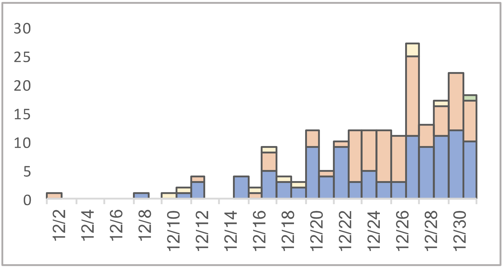

Parsing and visualizing the early patients onset curves from different sources (Huang, Li, China CDC, WHO)

# Visualization

Visualization at <https://flodebarre.github.io/covid_firstCases/China/visualization.html>  

# Source data

## CCDC (2019)

<https://max.book118.com/html/2020/0726/7154144025002153.shtm>

Date: 2019-12-30  

Data extracted from their first figure

## Huang et al. (2020)

<https://doi.org/10.1016/S0140-6736(20)30183-5>

Submitted: NA  
Published online: 2020-01-24  

Data extracted from their Figure 1B

## Li et al. (2020)

<https://doi.org/10.1056/NEJMoa2001316>

Submitted: NA   
Published online: 2020-01-29  

Data extracted from their Figure 1

## Yang et al. (2020)

<https://doi.org/10.1101/2020.02.10.20021675>

Submitted: 2020-02-11   
Withdrawn: 2020-02-21  

Data extracted from their Figure S2

## WHO (2020)

<https://www.who.int/docs/default-source/coronaviruse/who-china-joint-mission-on-covid-19---final-report-1100hr-28feb2020-11mar-update.pdf?sfvrsn=1a13fda0_2&download=true>

Submitted: 2020-02-28  
Revised: 2020-03-11  

Data extracted from the top panel of their Figure 2

## WHO (2021)

<https://www.who.int/docs/default-source/coronaviruse/final-joint-report_origins-studies-6-april-201.pdf?sfvrsn=4f5e5196_1&download=true>

Date: 2021-03-30

Data extracted from Fig 22 (p44)

and Fig 24 (p46)

## Drastic

Source unknown
