This repository gathers data on early cases in Wuhan from different sources, and provides a way to visualise and compare these early epidemic curves.

⚠️ The earliest epidemic curves are known to be incomplete. They are shown here because they make it possible to see where cases that were later retrospectively found are placed on the epidemic curves.  

Unless specified, the data were manually extracted, using [WebPlotDigitizer](https://apps.automeris.io/wpd/) for the most complex figures.

# Visualization

A tool to visualise and compare the different curves is available at <https://flodebarre.github.io/covid_firstCases/visualization.html>. It was coded by [Babarlelephant](https://github.com/babarlelephant).  

# Source data

## Wuhan & Hubei & district CDC (2019)

Source: <https://max.book118.com/html/2020/0726/7154144025002153.shtm> ([archive](https://archive.ph/hvuNv)), [translation](https://flodebarre.github.io/covid_firstCases/China/LocalCDC_2019/translation.md)

Date: 2019-12-30  

Data from: their first figure  
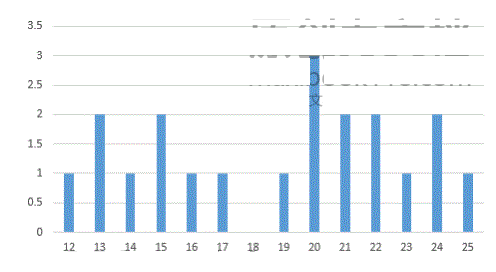

[Dataset](https://github.com/flodebarre/covid_firstCases/blob/main/China/LocalCDC_2019/data_LocalCDC_2019.csv)

## Huang et al. (2020)

Source: <https://doi.org/10.1016/S0140-6736(20)30183-5>

Date:  Submitted: NA    
       Published online: 2020-01-24  

Data from: their Figure 1B
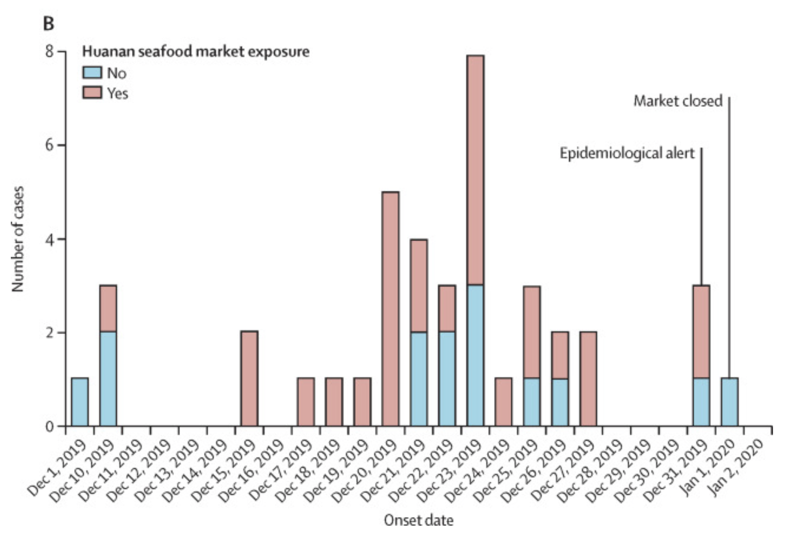

Shown: confirmed cases.  
Definition:  
> The presence of 2019-nCoV in respiratory specimens was detected by next- generation sequencing or real-time RT-PCR methods.

Their data source: "We reviewed clinical charts, nursing records, laboratory findings, and chest x-rays for all patients with laboratory- confirmed 2019-nCoV infection who were reported by the local health authority."

[Dataset](https://github.com/flodebarre/covid_firstCases/blob/main/China/Huang-etal_2020/data_Huang2020.csv)

## Li et al. (2020)

Source: <https://doi.org/10.1056/NEJMoa2001316>

Date:  Submitted: NA   
       Published online: 2020-01-29  

Data from: their Figure 1
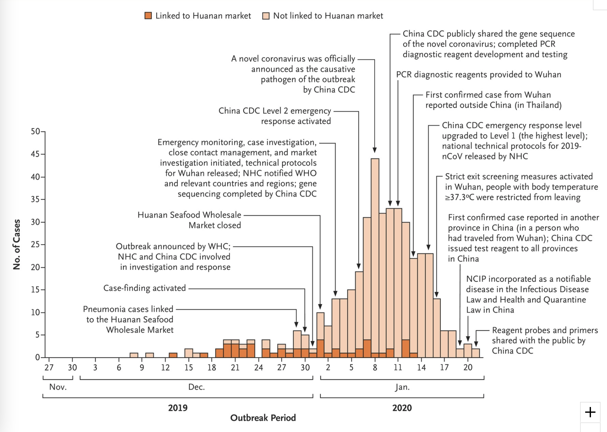

Shown: confirmed cases.  
Definition:  
> A confirmed case was defined as a case with respiratory specimens that tested positive for the 2019-nCoV by at least one of the follow- ing three methods: isolation of 2019-nCoV or at least two positive results by real-time reverse- transcription–polymerase-chain-reaction (RT-PCR) assay for 2019-nCoV or a genetic sequence that matches 2019-nCoV.

[Dataset](https://github.com/flodebarre/covid_firstCases/blob/main/China/Li-etal_2020/data_Li2020.csv)

## Yang et al. (2020)

Source: <https://doi.org/10.1101/2020.02.10.20021675>

Date:  Submitted: 2020-02-11   
       Withdrawn: 2020-02-21  

Data from: their Figure S2
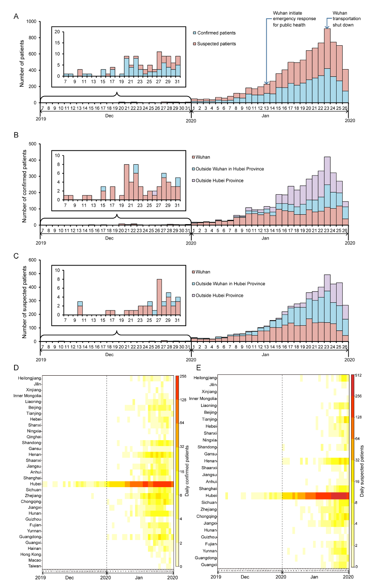

Shown: confirmed or suspected (see legend).

[Dataset](https://github.com/flodebarre/covid_firstCases/blob/main/China/Yang-etal_2020/data_Yang.csv)

## China CDC (2020)

Source: <https://weekly.chinacdc.cn/en/article/doi/10.46234/ccdcw2020.032>

Date:  Submitted: 2020-02-11 or after  
       Published: 2020-02-21 issue

Data from: their Figure 3
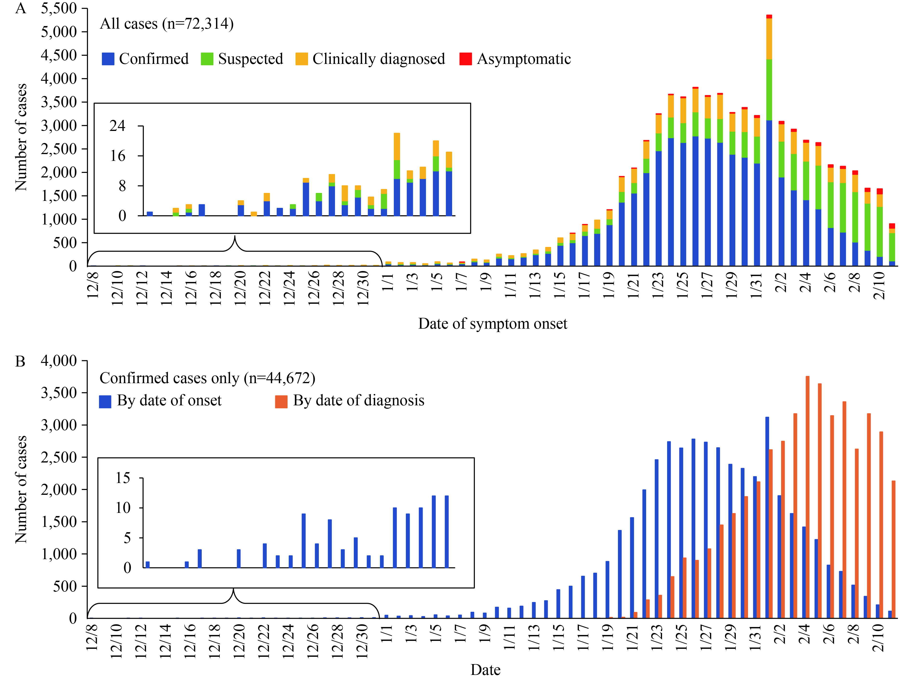

[Dataset](https://github.com/flodebarre/covid_firstCases/blob/main/China/CCDC_2020/data_CCDC.csv)

## WHO (2020)

Source: <https://www.who.int/docs/default-source/coronaviruse/who-china-joint-mission-on-covid-19---final-report-1100hr-28feb2020-11mar-update.pdf>

Date:  Submitted: 2020-02-28  
       Revised: 2020-03-11  

Data from: the top panel of their Figure 2
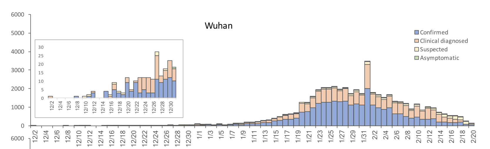

Shown: see legend.

[Dataset](https://github.com/flodebarre/covid_firstCases/blob/main/China/WHO_2020/data_WHO2020.csv)

## Pan et al. (2020)

Source: <https://doi.org/10.1001/jama.2020.6130>

Date:  Data extraction: 2020-03-09  
       Accepted: 2020-04-03

Data from: eFigure1  
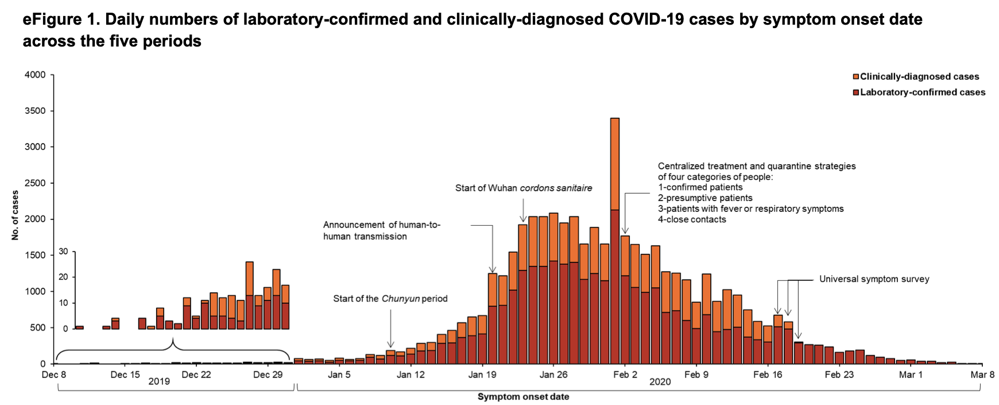

Shown: see legend.

[Dataset](https://github.com/flodebarre/covid_firstCases/blob/main/China/Pan-etal_2020/data_Pan2020.csv)

## Hao et al. (2020)

Source: <https://doi.org/10.1038/s41586-020-2554-8>

Date:  Submitted: 2020-04-14
       Accepted:  2020-07-10

Data from: [Ext figure 2@](https://www.nature.com/articles/s41586-020-2554-8/figures/5) and [Github dataset](https://github.com/chaolongwang/SAPHIRE/blob/master/data/Covid19CasesWH.csv)  
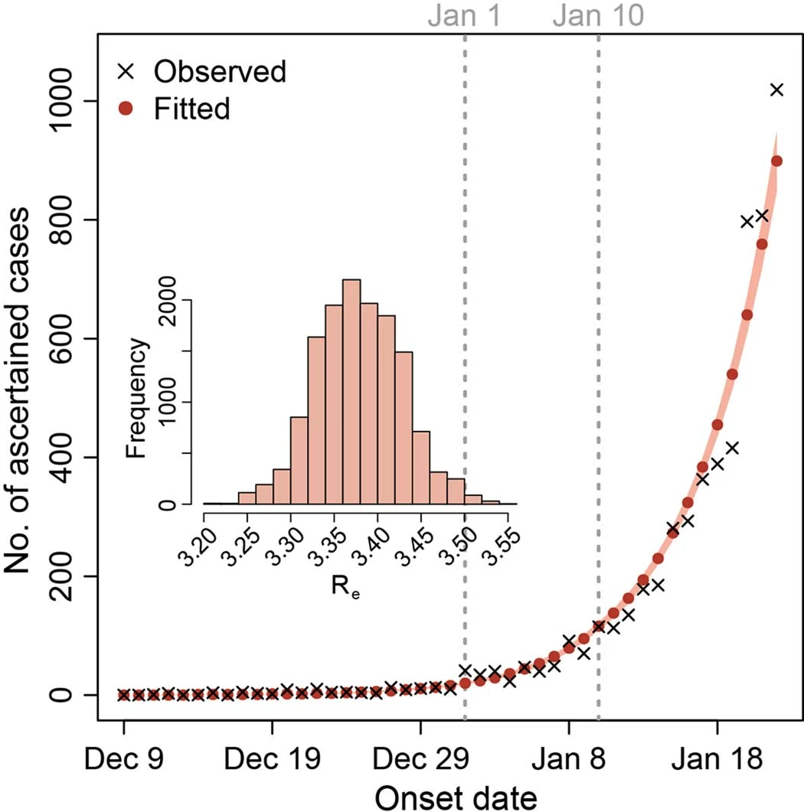

[Dataset](https://github.com/flodebarre/covid_firstCases/blob/main/China/Hao-etal_2020/data_Hao.csv)

## Fang Li et al (2021)

Source: <https://doi.org/10.1016/S1473-3099(20)30981-6>

Date: Submitted: NA  
      Published online: 2021-01-18  
      Data date: 2020-11-07 (last modification date in the online repo)  

Data from: Onset curve in the supplementary materials (with available [raw data](https://uflorida-my.sharepoint.com/:f:/g/personal/yangyang_ufl_edu/Ei-U0gqXRhNDixONBcXImBkBcBtSBHdm4LhZOQvdUjh2FA)).

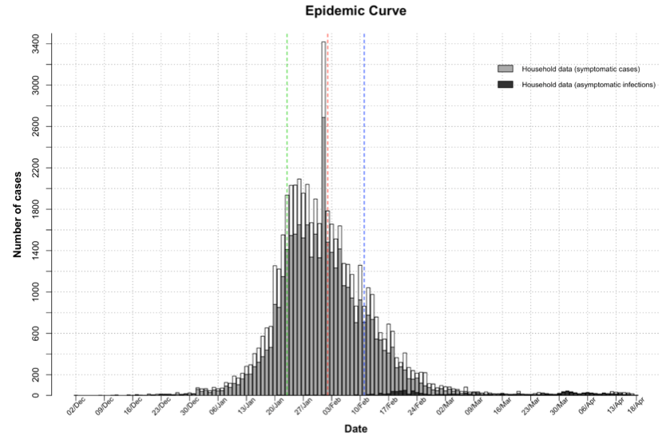

The same onset curve seems to be p.89 of a May 2020 [Chinese thesis](https://www.doc88.com/p-19629219677484.html) said to be from the CISDCP on 2020-02-27 (China information system for disease control and prevention)

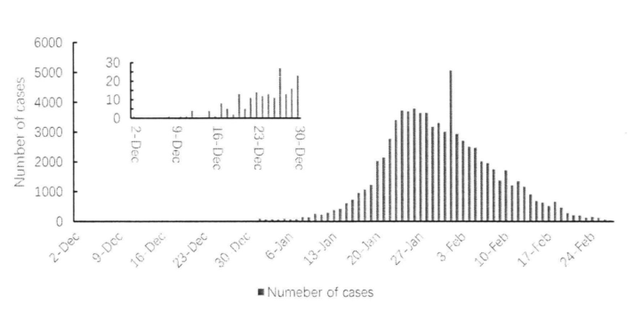

[Dataset](https://github.com/flodebarre/covid_firstCases/blob/main/China/FangLi-etal_2021/data_FangLi.csv)

## WHO (2021)

Source: <https://www.who.int/docs/default-source/coronaviruse/final-joint-report_origins-studies-6-april-201.pdf>

Date: 2021-03-30

Data from: Fig 22 (p44)
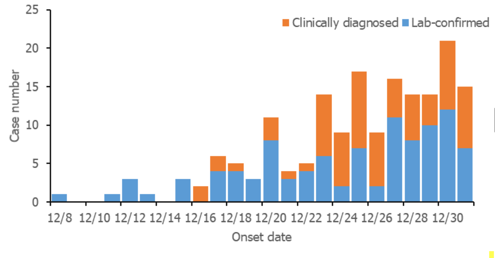

[Dataset](https://github.com/flodebarre/covid_firstCases/blob/main/China/WHO_2021/data_WHO.csv)

and Fig 24 (p46)
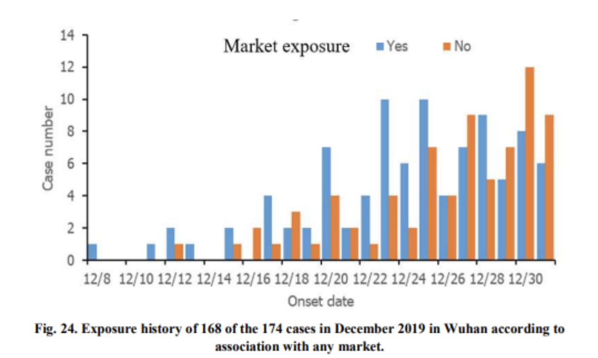

[Dataset](https://github.com/flodebarre/covid_firstCases/blob/main/China/WHO_2021/data_WHO_fig24.csv)

and Fig 27 (p50): cases that were later dismissed
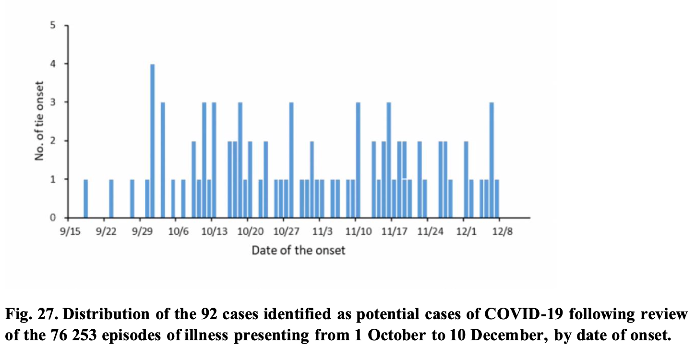

[Dataset](https://github.com/flodebarre/covid_firstCases/blob/main/China/WHO_2021/data_WHO_fig27.csv)

## Pekar et al. (2022)

Source: <https://www.science.org/doi/10.1126/science.abp8337>

Date: 2022-08

Data from: Fig S21 A, from WHO report and Li et al. (2021)  
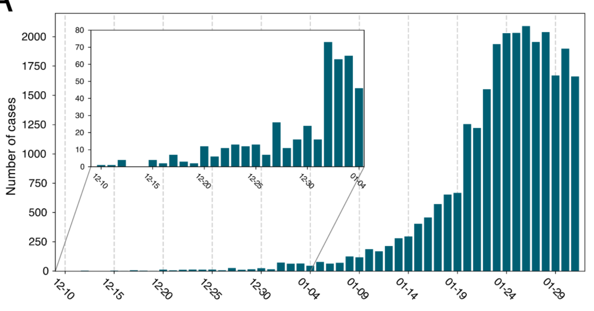

[Dataset](https://github.com/flodebarre/covid_firstCases/blob/main/China/Pekar-etal_2022/data_Pekar2022.csv)

## Drastic

Source: Provided by @babarlelephant.  

The Drastic dataset was obtained by cross-referencing hundred of articles on early patients. To be published soon.

# Notes

-  Explanations for the discrepancies between WHO 2021 and previous versions, given in the WHO report (p47, main document)

> Three possible cases with disease onset on 1, 2 and 7 December 2019, respectively, were initially identified as potential cases in the retrospective case search and have been included in some published papers. Clinical review of these three cases by the Chinese expert team led to their exclusion as possible cases on the basis of the clinical features of their illness.  
> In the case with onset on 1 December, a 62-year-old man with past history of cerebrovascular disease was judged to have had a minor respiratory illness in early December, which responded to antibiotics. He developed a further illness with onset on 26 December 2019, which was later laboratory- confirmed to be COVID-19. This patient had no reported contact to the Huanan market, whereas his wife, who was admitted on 26 December with a COVID-19 compatible illness, reported close contact with the Huanan market. She was also later laboratory-confirmed to have COVID-19. This couple, together with their son, became part of the first recognized family cluster of COVID-19.  
> In the second case, a 34-year-old woman with onset on 2 December 2019 was assessed to have had venous thromboembolic disease and subsequently pneumonia. She remained negative on SARS-CoV- 2 laboratory testing throughout a longer admission period ending in mid-February 2020.  
> In the third case, a 51-year-old man with onset on 7 December 2019 had symptoms of a cold and fever, and chest X-ray changes (“thickness of texture of both lungs and stripes”). His blood neutrophil count was raised and specific antibodies to Mycoplasma pneumoniae were detected. He responded well to antibiotics. Blood collected in April 2020 was reported negative for SARS-CoV-2-specific
antibodies.

-  A [March 2020 article in SCMP](https://www.scmp.com/news/china/society/article/3074991/coronavirus-chinas-first-confirmed-covid-19-case-traced-back) (available without paywall [here](https://sg.news.yahoo.com/coronavirus-china-first-confirmed-covid-152553818.html)) was claiming a case on Nov 2019 and 266 cases by the end of the year. The 266 number certainly refers to 174 (notified to NNDRS) plus 92 (compatible earlier cases reviewed) mentioned p.7 of the WHO 2021 report.
